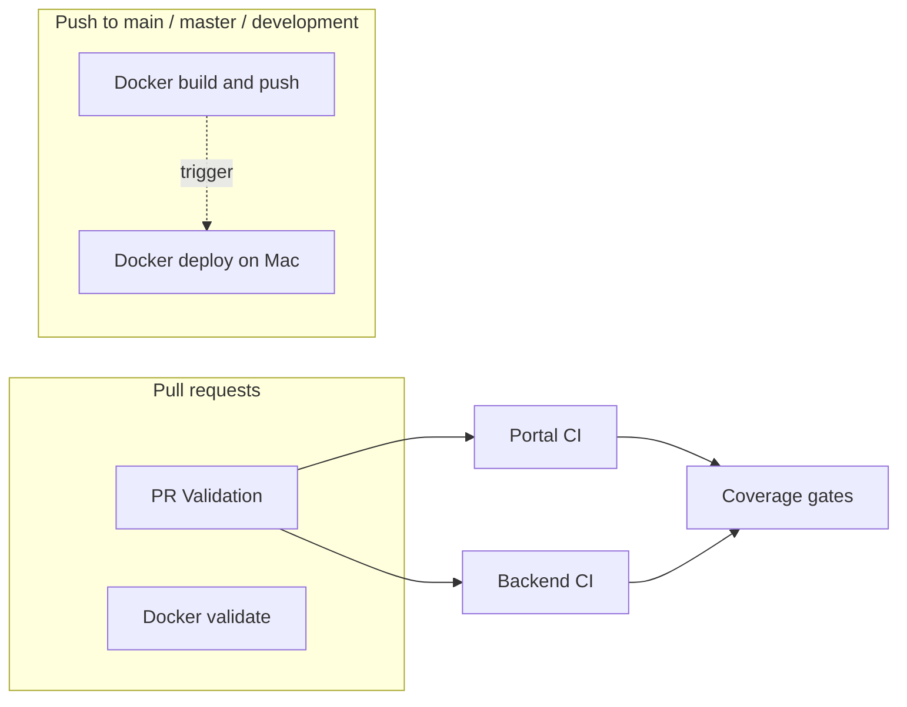

# GitHub Actions workflows

This folder is split by **concern**. Each YAML file is one workflow (one entry in the Actions tab).

## Overview

| Workflow file | When it runs | Purpose |
|---------------|----------------|---------|
| [`pr-validation.yml`](./pr-validation.yml) | PRs to `main` / `master` / `development` | Portal tests → backend tests → coverage gates (75%) → optional issue on failure |
| [`docker-validate.yml`](./docker-validate.yml) | Same PRs | Builds `Dockerfile.all-in-one` only (no push) |
| [`docker-build-push.yml`](./docker-build-push.yml) | Push to `main` / `master` / `development` | Build & push `cargohub` image to Docker Hub |
| [`docker-deploy-mac.yml`](./docker-deploy-mac.yml) | After **Docker — build & push** succeeds **or** manual **Run workflow** | Self-hosted Mac: pull, compose up, smoke tests, ngrok URLs |
| [`deploy-example.yml`](./deploy-example.yml) | Manual | Example / template |
| [`add-copilot-reviewer.yml`](./add-copilot-reviewer.yml) | As configured | Copilot reviewer automation |

## PR Validation — job order

1. **Portal** — `npm ci`, Vitest + coverage, upload artifact  
2. **Backend** — `dotnet` test + coverage, upload artifacts  
3. **Coverage gates** — merge thresholds (75% line & branch)  
4. **Notify** — open issue if a job failed (not on forks)

## Docker — deploy on Mac — step groups

The Mac workflow is **one job** (must stay on the same machine as Docker). Steps are grouped in the YAML as:

1. **Trigger & repo** — context, checkout at build SHA  
2. **Registry & host prep** — compose env, Docker Hub login  
3. **Image & stack** — `compose pull` (retry) **while the old stack may still be running**, then stop / free ports, then `compose up` (minimizes downtime vs pull-after-down)  
4. **Smoke checks** — API :8080, portal :3000, nginx :8888  
5. **Report** — job summary, optional ngrok public URLs  

Failure notification runs as a **separate job** (`notify-deploy-failure`) on GitHub-hosted Ubuntu so issues still open if the Mac job fails.

## Trigger chain (Docker)

1. **Automatic:** `docker-build-push.yml` completes **successfully** on `main` / `master` / `development` → `workflow_run` runs `docker-deploy-mac.yml` (only those branches; see `branches:` filter).
2. **Manual:** Actions → **Docker — deploy on Mac** → **Run workflow** (choose `main` or the branch that matches your image). Use this if the deploy job was skipped (e.g. after fixing the runner) or you need to redeploy the **latest** image from Docker Hub without rebuilding.

Skipped jobs: In **Docker — build & push**, **Open issue on build failure** is skipped when the build **succeeds** — that is expected.

The **workflow name** `Docker — build & push image` must stay in sync with `workflows:` in `docker-deploy-mac.yml`.

## Common failures (Actions tab)

| Symptom | Likely cause | What to do |
|---------|----------------|------------|
| **Docker — build & push** fails in seconds on “Log in to Docker Hub” | Missing or wrong `DOCKERHUB_USERNAME` / `DOCKERHUB_TOKEN` | Add both under **Settings → Secrets and variables → Actions**. Without them, the workflow still **builds** but skips push (see `docker-build-push.yml`). |
| **Automatic Dependency Submission (NuGet)** fails | GitHub-managed dependency workflow (org/repo policy, API, or billing) | **Settings → Code security** — review Dependency graph / submission settings, or disable the workflow if you do not use it. |
| **PR Validation** fails on job 3 (coverage gates) | Line or branch coverage below 75% on backend or portal | Open the job logs for **1 — Portal** and **2 — Backend**; fix tests or coverage. |
| **PR Validation** jobs 1–2 fail very quickly | Often a transient runner or checkout issue; re-run. If it persists, open the failed step log on GitHub. |
| **Many workflows fail in a few seconds** with an annotation on `.github` | **GitHub Actions billing:** failed payment or spending limit. Fix under **Settings → Billing and plans** (personal or org). Jobs show: *“The job was not started because recent account payments have failed or your spending limit needs to be increased.”* No repo code change fixes this. |
