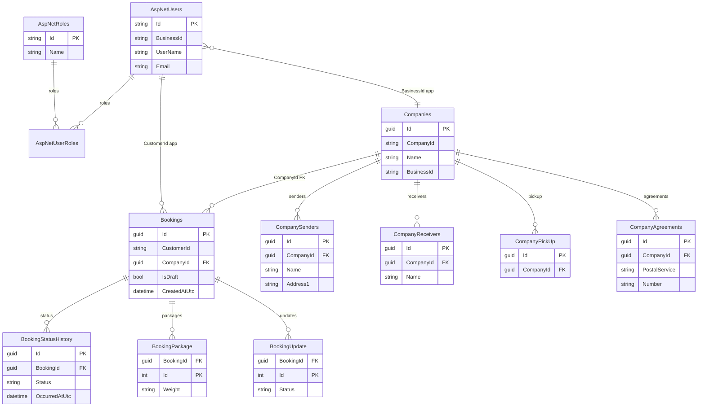
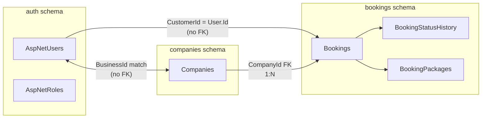
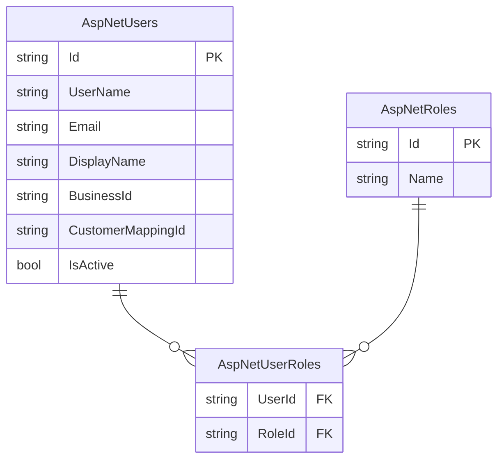
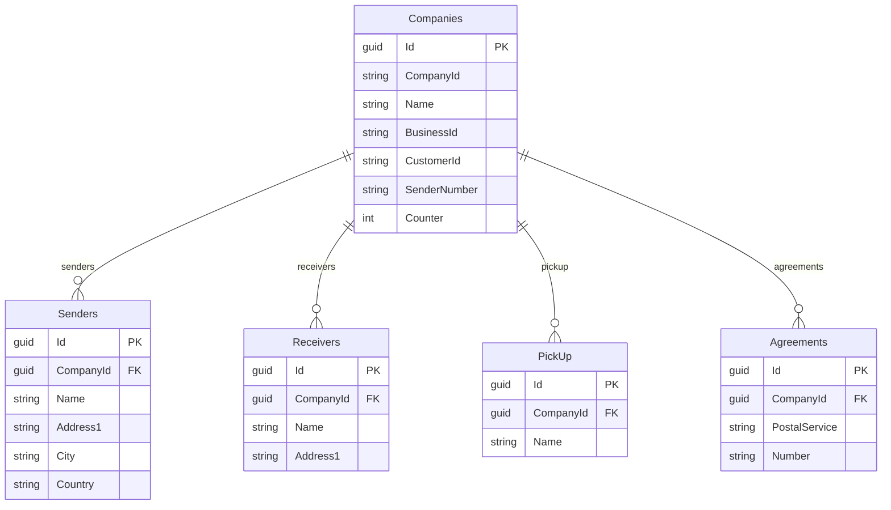
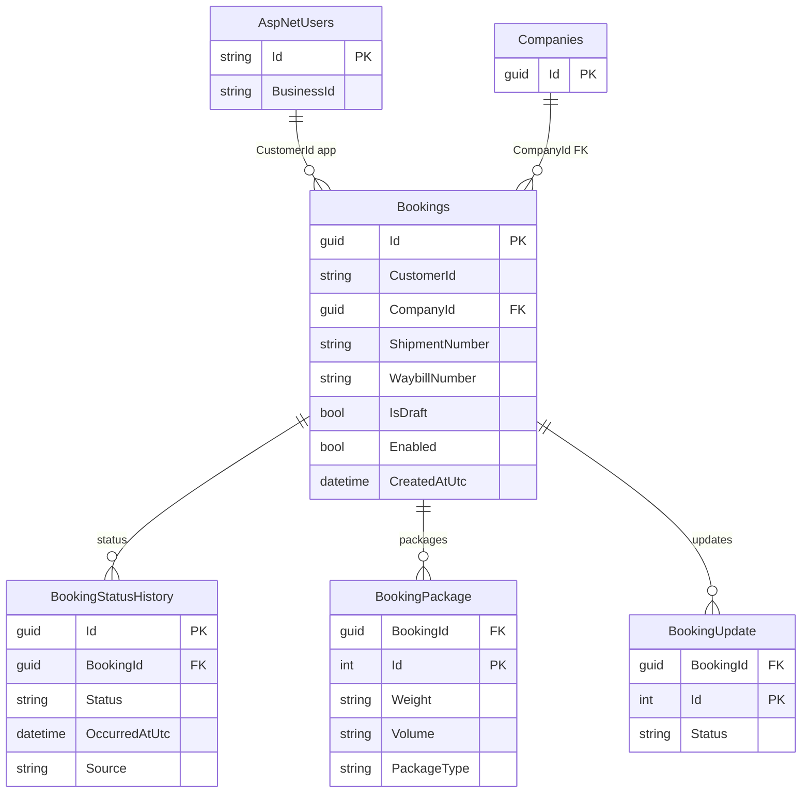

# Database entity diagram

PostgreSQL with three schemas: **auth**, **companies**, **bookings**.

---

## Full ER diagram (all connections)

Single diagram showing every entity and relationship. Labels **FK** = database foreign key; **app** = application-level link (no FK in DB).

---

## Overview

- **Company ↔ Users**: A company is linked to its users by **BusinessId** (user.BusinessId = company.BusinessId). One company has many users; no DB foreign key.
- **Booking → User**: Every booking has **CustomerId** = AspNetUsers.Id (the user who owns the booking). No DB foreign key; enforced in application code.
- **Booking → Company**: **CompanyId** is a real FK to Companies.Id (booking belongs to that company/shipper).

---

## 1. Auth schema

Identity tables: users, roles, and join tables.

| Table | Purpose |
|-------|--------|
| **auth.AspNetUsers** | Users (Id, UserName, Email, DisplayName, BusinessId, CustomerMappingId, IsActive) |
| **auth.AspNetRoles** | Roles (e.g. SuperAdmin, Admin, User) |
| **auth.AspNetUserRoles** | User–Role many-to-many |
| auth.AspNetUserClaims, AspNetUserLogins, AspNetUserTokens, AspNetRoleClaims | Identity claims, logins, tokens |

---

## 2. Companies schema

One **Companies** row per tenant/shipper; address books and agreement numbers are owned child data. **Users** belong to a company by matching **BusinessId** (ApplicationUser.BusinessId = Companies.BusinessId); there is no FK—the app resolves “user’s company” by this match.

| Table | Purpose |
|-------|--------|
| **companies.Companies** | Company (Id, CompanyId, Name, BusinessId, CustomerId, SenderNumber, DivisionCode, Counter). Optional owned: DefaultShipperAddress, Configurations. |
| Companies_SenderAddressBook | Sender address book (CompanyId FK) |
| Companies_AddressBook | Receiver address book (CompanyId FK) |
| Companies_PickUpAddressBook | Pick-up addresses (CompanyId FK) |
| Companies_AgreementNumbers | Agreement numbers per postal service (CompanyId FK) |

---

## 3. Bookings schema

**Bookings** is the main aggregate; status history, packages, and updates are child tables. Each booking belongs to a **user** (CustomerId) and a **company** (CompanyId FK).

| Table | Purpose |
|-------|--------|
| **bookings.Bookings** | Booking (Id, CustomerId, CompanyId FK, ShipmentNumber, WaybillNumber, IsDraft, Enabled, CreatedAtUtc, UpdatedAtUtc). Owned columns: Header, Shipment, Shipper, Receiver, Payer, PickUpAddress, DeliveryPoint, ShippingInfo. |
| **bookings.BookingStatusHistory** | One row per milestone (Draft, Waybill, Confirmed, etc.); BookingId FK. |
| Bookings_Packages | Packages for the booking; BookingId FK, composite PK (BookingId, Id). |
| Bookings_Updates | Transport/tracking updates; BookingId FK, composite PK (BookingId, Id). |

---

## Key relationships

| From | To | Type |
|------|-----|------|
| **AspNetUsers** | **Companies** | Application: user.BusinessId = company.BusinessId → one company has many users (no FK) |
| **Bookings.CustomerId** | **AspNetUsers.Id** | Application: booking belongs to one user (no FK) |
| Bookings.CompanyId | Companies.Id | FK (optional, cascade delete) |
| BookingStatusHistory.BookingId | Bookings.Id | FK |
| BookingPackage.BookingId | Bookings.Id | FK (owned) |
| BookingUpdate.BookingId | Bookings.Id | FK (owned) |
| Company address/agreement tables | Companies.Id (CompanyId) | FK (owned) |

---

## Notes

- **Schemas**: `auth` = Identity; `companies` = company aggregate; `bookings` = booking aggregate.
- **Company has users**: Not stored as a FK. Users with the same BusinessId as a company are considered that company’s users (resolved in code).
- **Booking has user**: Bookings.CustomerId holds AspNetUsers.Id; no FK in the DB. The app uses it to list “my bookings” and enforce ownership.
- **Owned types**: `OwnsOne` (e.g. Header, Configurations) are usually columns on the parent table; `OwnsMany` (Packages, Updates, address books) are separate tables with a FK to the parent.
